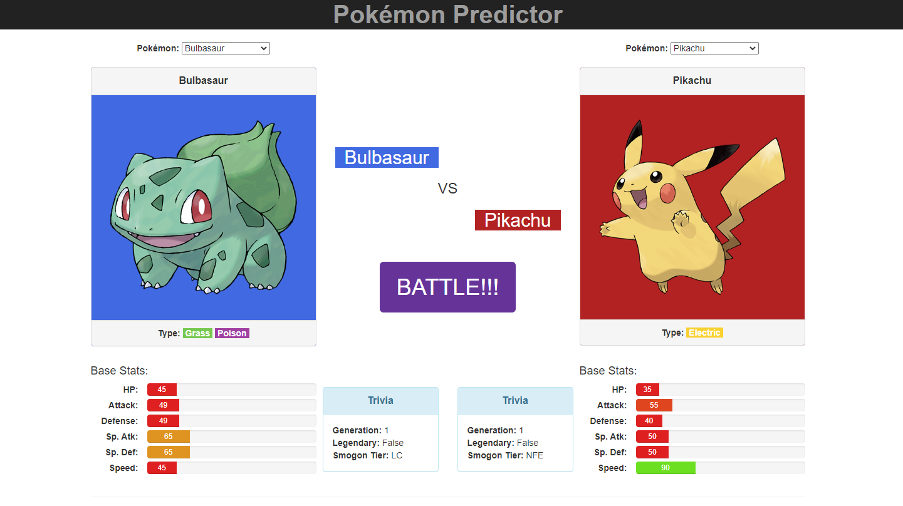
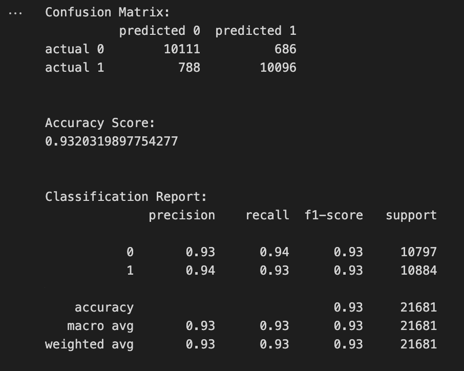
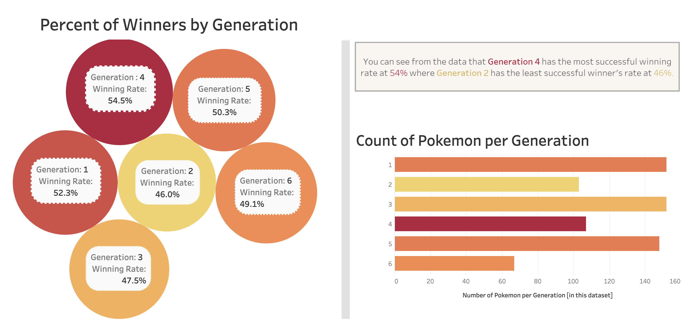
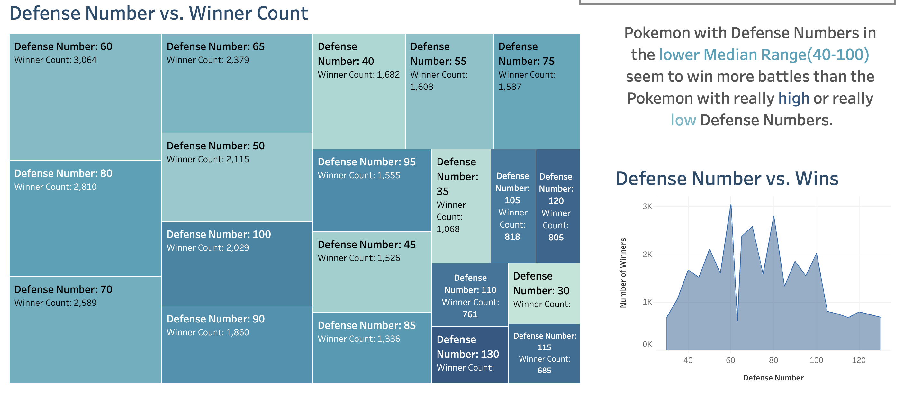
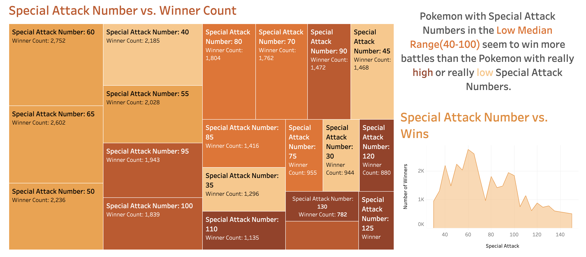
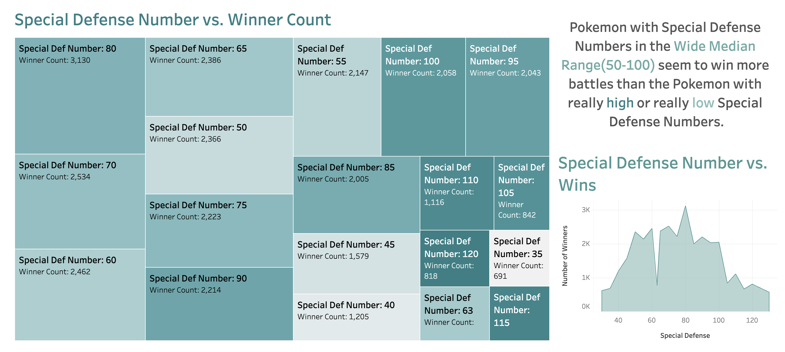

# Pokemon-Predictor

## Overview

In this project, Pokemon stats and battle outcome data were analyzed in a machine learning model to determine the likelihood of selected Pokemon winning battles.

## Cloud Deployment

**Try our app out here:** [Pokemon Predictor](http://ec2-3-14-73-36.us-east-2.compute.amazonaws.com)  

  
Webpage screenshot  

  
Ecosystem diagram

## Contributors

* [Becky Klosowski](https://github.com/andcetera)
* [Christin Davis](https://github.com/christinamberdavis)
* [Crystal Butler](https://github.com/cmbutler83)
* [Danielle Anderson](https://github.com/dganderson94)
* [Lea Jinks](https://github.com/leajinks)

## How to use the Pokemon Predictor

To run the Pokemon Predictor locally:

1. Run the data_prep_final.ipynb file in the data_processing folder. This will read the pokemon.csv and combats.csv, scrape Pokemon tier data from smogon.com, combine this data into one dataframe with one row per battle, then convert this into a sqlite file.
2. Run the ml_model.ipynb file in the ml folder. This will split the data from the sqlite file into training and test sets, assign targets and features, scale the data, create logistic regression models to calculate model accuracy, and serialize the model using Pickle so it can be run on a flask app.
3. Run python app.py to open the flask app locally within a virtual environment including the relevant pacakges, or visit our cloud deployment at the link listed above.  Required packages include:  

    * Python 3.7
    * flask
    * pandas
    * sqlalchemy
    * scikit-learn
    * pathlib

4. Select Pokemon in both dropdown menus, then click the Battle button. A "Winner!" label will appear next to the photo of the Pokemon predicted to win.

## Target and Features

Since the purpose of this model is to predict Pokemon success in battle, the target is the "Did_the_first_pokemon_win" column. That is, we are classifying the first pokemon in the battle as a winner or loser of the battle. 

The features of this model include:

* Hit Points (HP)
* Attack Points
* Defense Points
* Special Attack Points
* Defense Points
* Speed Points
* Legendary Status
* Pokemon Type (Primary and Secondary)
* Pokemon Tier
* Pokemon Generation

Each Point stat is an integer that ranges from 0-255, depending on the stat and the pokemon. The Pokemon Type, Tier, and Generations are strings, with 18 possible primary and secondary types, 13 possible tiers, and 5 possible generations.

With two sets of stats per row, and each string value converted to an individual feature, our model in total includes 118 features.

## Classification Model

For our ML model, we used Random Forest, which combines multiple decision trees. By aggregating the predictions of many individual decision trees, it reduces overfitting and improves generalization performance.

* High accuracy: Random Forest can produce highly accurate results, even with large and complex datasets, due to its ability to handle multiple features.
* Robustness: Random Forest is less prone to overfitting than other algorithms, such as decision trees, because it creates multiple decision trees and averages their results to make predictions, which helps to reduce the variance in the model. We configured our model to use 50 estimators. 
** 50 estimators produced results almost as well as 500 estimators, but better than 75 or 100, and with better performance.
* Feature selection: Random Forest can be used to identify the most important features in a dataset, which can be useful for feature selection and feature engineering.
* Scalability: Random Forest can be used with large datasets, making it suitable for big data applications.
*Interpretability: Random Forest can provide insights into how the model makes predictions, which can help to explain the underlying relationships in the data.

The Random Forest model scored well with our dataset, with 93% accuracy and 93-94% precision. 

### Other Models

To ensure the best results, we tried multiple ML models on the data to see which was best suited to correctly classifying the data. 

#### Logistic Regression

#### K Nearest Neighbots

## Analysis

The following visualizations are available on [Tableau Public.](https://public.tableau.com/app/profile/crystal1427/viz/PokemonStats_16813522570140/PokemonWinnerStats?publish=yes)

Win rates for all generations hovered around 50%. The largest gap in win percentage is between generations 2 and 4, 4 being 8.5% higher than 2.

A higher battle stat equates to an advantage for a Pokemon over one with a lower stat, so one might expect a positive correlation between increasing stats and win percentages. However, for all battle stats (attack, defense, HP, speed, special attack, special defense), Pokemon in the median range of these values performed better than Pokemon with high or low values. This is generally due to Pokemon being created with a balanced set of advantages and disadvantages, so one particular Pokemon doesn't obliterate the rest. For example, Geodude, a rock pokemon, has relatively high attack and defense, but low HP, speed, special attack, and special defense.

  
  
  
  
  

- - -

## Data Sources

* Pokemon and Battle Data: [Tuan Nguyen Van Anh via Kaggle](https://www.kaggle.com/datasets/tuannguyenvananh/pokemon-dataset-with-team-combat?select=pokemon.csv)

* Pokemon Tiers: [Smogon](https://www.smogon.com/dex/xy/pokemon/)

Artwork:

* Gathered by [Rohan Asokan via Kaggle](https://www.kaggle.com/datasets/arenagrenade/the-complete-pokemon-images-data-set)
and supplemented with images from [Bulbapedia](https://bulbapedia.bulbagarden.net/wiki/Main_Page)
